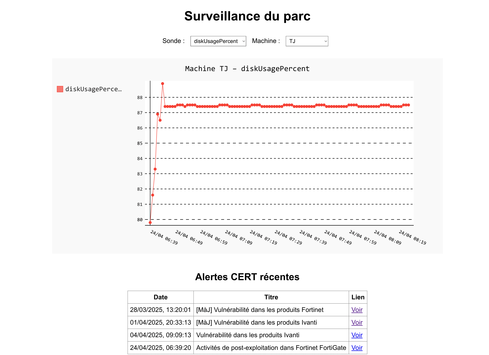

# Surveillance System for Ubuntu Servers

## Dependancies
You have to install the following dependancies:
- python3
    - json
    - beautifulsoup4
    - flask
    - pygal
    - psutil
    - os
    - datetime
    - subprocess
    - glob
- postfix
- cron

## Setup
In the file <font color="cyan">controllers/CrisisController.py</font> you habe to input your personal admin email which will receive crisis alerts.

In <font color="cyan">controllers/MailController.py</font> you can define the origin mail that will be used as the sender's email for any server related content. Please be careful as it must be accurate and accepted by your postfix configuration.

In <font color="cyan">main.py</font> you can define trigger level that will send an alert on the email you defined.

If wanted, you can setup a crontab to generate logs and json on a regular basis :
    
    crontab -e

    Then write the following (with x being the time interval in minutes) :

    */x * * * * path_to_your_main.py >> path_to_a_.log_file

    (Ctrl + X then Y to save)

## Web
### Server
Once in the folder of the project, launch flask app with :
- ```python3 app/app.py```

You can access it with :
- localhost:12345

or, if you have port redirection (in vm for instance) :
- localhost:your_host_port

### Website


You can select the stat you want to display *and* the machine you want to check.

## Add a sonde
You can add a sonde in the folder <font color="cyan">**/sondes**</font> . It can either be a python or bash file.
<br>Be sure that your file outputs something. for example :
- machineName.sh &rarr; `hostname -f`
- cpuPercent.py &rarr; `print(f"{psutil.cpu_percent(interval=1)}")`